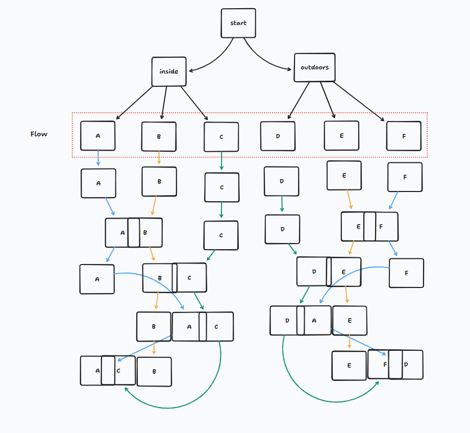

# Onkery — prompts and sitting

Source of the ask lists: `prototype/mechanics-loop/src/opener.ts`. This file is the readable inventory of what the phone says, and the order of a sitting.

No typing. The participant answers by filming.

Aim of the piece: [purpose.md](purpose.md).

## Sitting

A visit starts with welcome, camera grant, then inside or outside. That chooser starts a trio: inside walks A then B then C, outside walks D then E then F. After a trio, the chooser comes back. Welcome stays skipped. The camera stays warm.

The first sitting after a chooser starts with *Show me anything.* Stacked sittings in the trio skip it and open on Ask A.

1. Welcome
2. How it works. Continue.
3. Camera grant
4. Inside or outside
5. *Show me anything.* Hint: *Tap the button to record a short video.* Then a looping montage of that pool, caption *anything*.
6. Ask A. Then a looping montage of that ask's pool, with its caption on every cut.
7. Ask B. Same.
8. Frame: *Someone else was asked this too.*
9. Opener. They were asked the same as Ask B. Flows A and B play the plant clip and the Line `I'll get to it`. Every other opener is the live camera, no Line.
10. *Your turn.*
11. *Show me yours,* with Ask B repeated underneath. Filmed on Ask B's relation. Joins Ask B's pool. Caption *yours*.
12. *That's it.* Tap dissolves into the next flow's Ask A, or back to the chooser when the trio is done.

A montage wants at least three other people when the pool has them, and loops until they tap. Your own take is in it unmarked. Do not put clips in the repo. OK on a take sends it to the pool.

## Flow

Start splits inside / outdoors. The Flow row is the six named sittings:

- **A** keeping → delay (plant)
- **B** residue → delay (plant)
- **C** residue → justdone
- **D** justdone → keeping
- **E** keeping → delay
- **F** delay → residue

A box with two or three letters is a montage that has widened into a neighboring pool on the ring. `[D|A|E]` is the invisible seam: the indoor plant in an outdoor reel when delay is thin. The loops at the bottom are the trio walking on, then around again after the chooser. The sitting order stays neighbor to neighbor (A then B then C). It does not jump A to C.

Widening only borrows a relation adjacent on the ring. Inside does not wrap keeping to justdone. Outside does not wrap residue to justdone.

## Welcome and grant

This is Onkery.

You film small things from where you are.

Continue.

You get directions to take a video.

Then you see how strangers answered.

No names. Your videos stay inside Onkery.

Continue.

Onkery needs the camera.

Nothing is recorded until you press the shutter.

Allow camera.

If they refuse: *You won't be able to continue unless you grant access to the camera.* No audio. Try again, back to the grant.

## Chooser

Are you outside, or indoors, right now?

I'm indoors / I'm outside

It doesn't work very well inside a vehicle.

Inside starts Flow A. Outside starts Flow D. After C or F, this screen returns.

## First film

Show me anything.

Tap the button to record a short video.

There. You captured a clip.

## Relations

Asks are relations, not object classes. The ring is the widening order:

keeping → delay → residue → justdone → keeping

| Relation | What it pulls |
|---|---|
| delay | something left undone |
| residue | evidence of a day |
| keeping | a chosen or borrowed thing |
| justdone | what a body was in the middle of |

## Dealt flows

**Flow A — inside — keeping → delay**

- Show me what sits next to where you sit.
- Show me something you keep meaning to take care of. Do not touch it.

**Flow B — inside — residue → delay**

- Show me the last thing you used and did not put away.
- Show me something you keep meaning to take care of. Do not touch it.

**Flow C — inside — residue → justdone**

- Show me a mess you made.
- Show me what you were just doing. Do not set it up.

**Flow D — outside — justdone → keeping**

- Show me the weather you have been under.
- Show me something you brought with you.

**Flow E — outside — keeping → delay**

- Show me something out here that is not yours.
- Show me something out here that has been left.

**Flow F — outside — delay → residue**

- Show me something that looks like it is waiting.
- Show me something someone left.

## Indoor deck (not dealt)

These lines stay in the inventory. They are not in A–C.

**delay**

- Show me something that has been sitting there.
- Show me something unfinished.

**residue**

- Show me something that is still out from earlier.

**keeping**

- Show me something you keep nearby.
- Show me something here that is not yours.

**justdone**

- Show me the last thing your hands were on.
- Show me where you were standing before this.

## Outdoor deck (not dealt)

**residue**

- Show me some garbage.

**justdone**

- Show me what's under your feet.
- Show me something moving that is not you.
- Show me where you were before you stopped.

## Openers

Ask B decides the opener.

- Flows A and B: *Show me something you keep meaning to take care of. Do not touch it.* Clip `/opener.mp4`. Line: `I'll get to it`.
- Flow C: *Show me what you were just doing. Do not set it up.* Live stand-in. No Line.
- Flow D: *Show me something you brought with you.* Live stand-in. No Line.
- Flow E: *Show me something out here that has been left.* Live stand-in. No Line.
- Flow F: *Show me something someone left.* Live stand-in. No Line.

On screen: *They were asked* plus that line. Then the Line, if there is one.

## Close

Someone else was asked this too.

Your turn.

Show me yours.

That's it.

## Montage

Procedural. Clips in that ask's pool, at least three other people when the pool has them. Own takes spliced unmarked into the fast stretch. Caption on every cut. Cuts start around a second, accelerate, then two slower tail cuts. Then it loops from the top until they tap.

When the pool is short, the montage widens into an adjacent relation on the ring. Same-relation pools can also cross inside and outside. Caption stays the ask they just answered. See [Flow](#flow).
